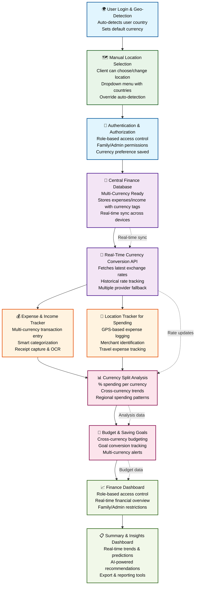

# Multi-Currency & Global Finance Manager System - Workflow Diagram

## System Architecture Overview

### 🔄 **Data Flow Process**

1. **User Authentication & Geo-Detection**
   - Automatic country detection via IP/device location
   - Default currency setting based on location
   - Role-based access (Individual, Family, Admin)

2. **Manual Location Selection**
   - Client can easily choose or change location manually
   - Dropdown menu with comprehensive country list
   - Override auto-detection when needed
   - Currency preference saved to user profile

3. **Multi-Currency Database Layer**
   - Stores all transactions with currency metadata
   - Real-time synchronization across devices
   - Historical data preservation

4. **Currency Conversion Engine**
   - Live exchange rate updates
   - Multiple API provider integration
   - Fallback mechanisms for reliability

5. **Transaction Management**
   - Multi-currency expense/income entry
   - Location-based transaction logging
   - Smart categorization and tagging

6. **Analytics & Insights**
   - Cross-currency spending analysis
   - Budget tracking across currencies
   - Predictive financial insights

7. **Dashboard & Reporting**
   - Role-based dashboard access
   - Real-time financial overview
   - Export and sharing capabilities

### 🎨 **Design Features**

- **Flat Design Icons**: Clean, minimal iconography
- **Professional Color Palette**: ERP-style color coding
- **Rounded Rectangles**: Modern, approachable design
- **Clear Data Flow**: Logical progression with feedback loops
- **Role-Based Access**: Security and privacy considerations

### 🔧 **Technical Implementation**

- **Real-time Updates**: WebSocket connections for live data
- **Offline Support**: Local storage with sync capabilities
- **Multi-device Sync**: Cloud-based data synchronization
- **API Integration**: Multiple currency rate providers
- **Security**: End-to-end encryption for sensitive data
